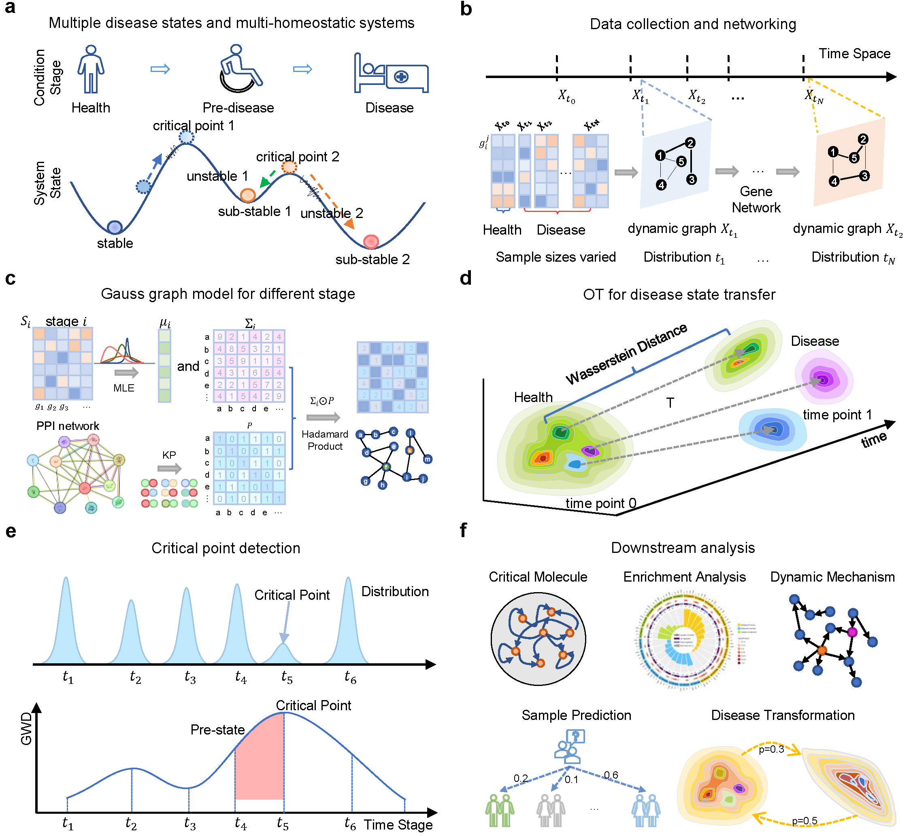
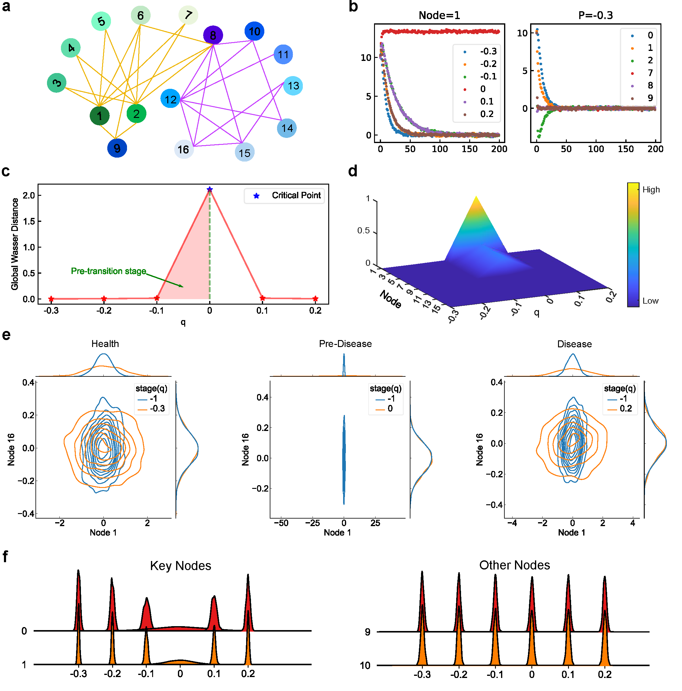

# GGOT: An Optimal Transport method for disease critical point detection


# Overview



# Dataset

| Dataset                                                      | Description  | Species      | stages | Type of disease                       |
| ------------------------------------------------------------ | ------------ | ------------ | ------ | ------------------------------------- |
| [GSE48452](https://www.ncbi.nlm.nih.gov/geo/query/acc.cgi?acc=GSE48452) |              | Home sapiens | 3      | Chronic progressive benign disease    |
| [LUAD](https://portal.gdc.cancer.gov/projects/TCGA-LUAD)     |              | Home sapiens | 7      | Chronic progressive malignant disease |
| [COAD](https://portal.gdc.cancer.gov/projects/TCGA-COAD)     |              | Home sapiens | 7      | Chronic progressive malignant disease |
| [GSE2565](https://www.ncbi.nlm.nih.gov/geo/query/acc.cgi?acc=GSE2565) | lung injury  | Mus musculus | 9      | Acute progressive noncritical illness |
| [GSE154918](https://www.ncbi.nlm.nih.gov/geo/query/acc.cgi?acc=GSE154918) | Septic shock | Home sapiens | 3      | Acute progressive critical illness    |
| XJTUSepsis                                                   | XJTUSepsis       | Home sapiens | 7      | Acute progressive critical illness    |

# Constructing the model 

## Install required packages 

```bash
pip install -r requirements.txt
```

## Running the model for different dataset

```bash
python run_model.py -d Sepsis -s Human
```


# Result


